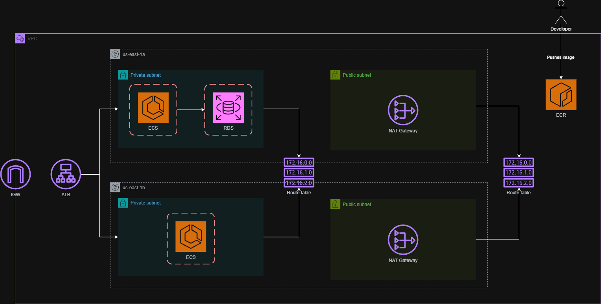

# Wanderlog API

A cloud-native travel journal API built with Rust and AWS services.

## Overview

Wanderlog allows users to create and manage travel entries with location data and images. Built with performance and scalability in mind using Rust and modern cloud architecture.

## Tech Stack

- **Backend**: Rust (Actix-web)
- **Database**: PostgreSQL (AWS RDS)
- **Storage**: AWS S3
- **Infrastructure**:
  - AWS ECS (Container orchestration)
  - AWS ECR (Container registry)
  - AWS VPC with public/private subnets
  - Application Load Balancer

## Key Features

- User management
- Travel entry CRUD operations
- Image upload via S3 presigned URLs
- Geolocation support
- Cloud-native architecture

## API Endpoints

### Users

- `POST /api/users` - Create user
- `GET /api/users` - List users
- `GET /api/users/{id}` - Get user details

### Travel Entries

- `POST /api/travel-entries` - Create entry
- `GET /api/travel-entries` - List entries
- `PUT /api/travel-entries/{id}` - Update entry
- `DELETE /api/travel-entries/{id}` - Delete entry
- `POST /api/travel-entries/{id}/images` - Add image
- `GET /api/travel-entries/{id}/images` - List entry images

### Image Upload

- `POST /api/uploads/presigned-url` - Generate S3 upload URL
- `POST /api/uploads/download-url` - Generate S3 download URL

## Infrastructure

### Architecture Diagram

### AWS Resources

- VPC with 2 public and 2 private subnets across AZs
  - Public subnets: 10.0.1.0/24, 10.0.2.0/24
  - Private subnets: 10.0.11.0/24, 10.0.12.0/24
- NAT Gateways for private subnet internet access
- RDS instance in private subnet
  - Endpoint: wanderlog-db.cv4ygmeii92x.us-east-1.rds.amazonaws.com:5432
- S3 bucket (wanderlog-uploads) for image storage
- ECS cluster (web-app-cluster) for container orchestration
- ECR repository: 199614859729.dkr.ecr.us-east-1.amazonaws.com/web-app-repo

## Development

Requires:

- Rust
- Docker
- AWS CLI
- Terraform

Environment variables needed:

- `DATABASE_URL`
- `AWS_BUCKET_NAME`
- AWS credentials
